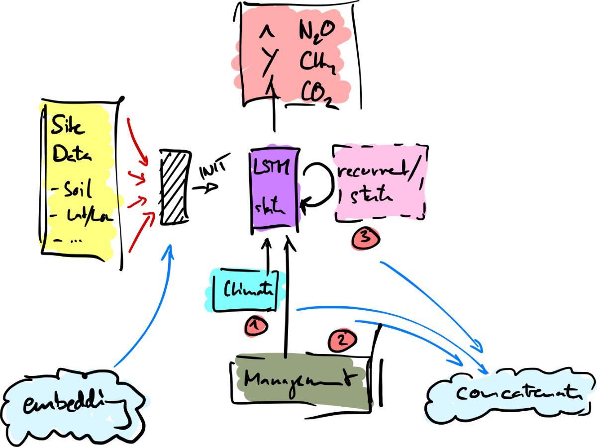

# sumo_dndc
An attempt of a **su**rrogate **mo**del for LandscapeDNDC. Very experimental 🤓

## Summary

In brief, this is an attempt to mimic the behavior of LandscapeDNDC using a artifical neural network (ANN). Ideally, this will allow a faster inference/ model prediction without the need for a full LandscapeDNDC simulation.

<figure>
    
    <figcaption>A sketch of the model setup</figcaption>
</figure>

In the initial phase, only a single side is used for training.

## Libraries

We use PyTorch for building the ANN and the (yet unreleased) fastai v2 for data handling and model training.

## ToDos

...
